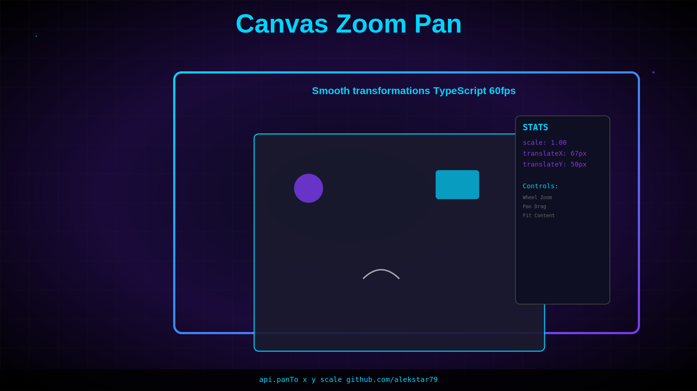

# Zoom Pan

[](https://www.npmjs.com/package/@alekstar79/zoom-pan)
[](https://github.com/alekstar79/zoom-pan)
[]()
[]()
[]()
[]()

A high-performance, TypeScript-first library for 2D zoom and pan transformations in the browser. Built with reactive state management, batched updates for smooth animations, and a clean, composable API.



<!-- TOC -->
* [Zoom Pan](#zoom-pan)
  * [✨ Features](#-features)
  * [📥 Installation](#-installation)
    * [npm](#npm)
    * [yarn](#yarn)
    * [pnpm](#pnpm)
  * [🚀 Quick Start](#-quick-start)
    * [Basic Usage (Helper Function)](#basic-usage-helper-function)
    * [Default Key Bindings](#default-key-bindings)
    * [Hook Usage (Fine-grained Control)](#hook-usage-fine-grained-control)
    * [Advanced Usage (Class-based)](#advanced-usage-class-based)
  * [📚 API Documentation](#-api-documentation)
    * [`zoomPan(config: IZoomPanHelperConfig): IZoomPanInstance`](#zoompanconfig-izoompanhelperconfig-izoompaninstance)
    * [`useZoomPan(config: IUseZoomPanConfig): IZoomPanAPI`](#usezoompanconfig-iusezoompanconfig-izoompanapi)
    * [`Renderer` Class](#renderer-class)
  * [🎯 Common Patterns](#-common-patterns)
    * [Center Zoom](#center-zoom)
    * [Fit to Bounds](#fit-to-bounds)
    * [Animation](#animation)
  * [🧪 Testing](#-testing)
  * [📦 Build Targets](#-build-targets)
  * [🎨 Styling](#-styling)
  * [🌍 Browser Support](#-browser-support)
  * [🤝 Contributing](#-contributing)
  * [📄 License](#-license)
  * [📞 Support](#-support)
<!-- TOC -->

## ✨ Features

- **🚀 High Performance**: Batches DOM updates using requestAnimationFrame for smooth 60fps interactions
- **📦 Fully Typed**: Written in TypeScript with strict type checking and full type exports
- **🔍 Zero Dependencies**: Lightweight (~5KB minified) with no external dependencies
- **♻️ Reactive State Management**: Built-in Watcher system for reactive transformation tracking
- **🎯 Flexible API**: Three levels of abstraction - Renderer (core), useZoomPan (hook), zoomPan (helper)
- **⚙️ Configurable**: Full control over zoom constraints, sensitivity, and behavior
- **🧪 Well Tested**: Comprehensive test coverage with Vitest
- **♿ Accessible**: Supports keyboard controls and modifier keys
- **🌍 Cross-browser**: Works on all modern browsers and has fallbacks for older APIs

## 📥 Installation

### npm

```bash
npm install zoom-pan
```

### yarn

```bash
yarn add zoom-pan
```

### pnpm

```bash
pnpm add zoom-pan
```

## 🚀 Quick Start

### Basic Usage (Helper Function)

The simplest way to get started - just one function call with default event bindings:

```typescript
import { zoomPan } from 'zoom-pan';

const element = document.getElementById('canvas');

// Activate zoom/pan with default controls
const { api, destroy } = zoomPan({
  element,
  minScale: 0.5,
  maxScale: 5,
  scaleSensitivity: 50,
});

// Programmatic control
api.zoom({ x: 100, y: 100, deltaScale: 1 }); // Zoom in at point (100, 100)
api.panBy({ movementX: 50, movementY: 50 }); // Pan by offset
api.panTo({ x: 200, y: 200, scale: 2 });     // Pan to position with scale

// Cleanup
destroy();
```

### Default Key Bindings

- **Zoom**: Ctrl + Mouse Wheel
- **Pan**: Shift + Left Mouse Drag

### Hook Usage (Fine-grained Control)

For more control over event handling:

```typescript
import { useZoomPan } from 'zoom-pan';

const element = document.getElementById('canvas');

const { zoom, panBy, panTo } = useZoomPan({
  element,
  minScale: 0.1,
  maxScale: 30,
  scaleSensitivity: 50,
});

// Attach custom event listeners
element.addEventListener('wheel', (event) => {
  if (event.ctrlKey) {
    event.preventDefault();
    zoom(event);
  }
});

element.addEventListener('mousemove', (event) => {
  if (event.shiftKey && event.buttons === 1) {
    panBy(event);
  }
});
```

### Advanced Usage (Class-based)

For complex scenarios with state tracking:

```typescript
import { Renderer } from 'zoom-pan';

const element = document.getElementById('canvas');

// Create renderer with optional Watcher integration
const renderer = new Renderer({
  minScale: 0.1,
  maxScale: 30,
  scaleSensitivity: 50,
});

// Access transformation state
const state = renderer.getState();
console.log(state.scale, state.translateX, state.translateY);

// Track state changes reactively
if (renderer instanceof Renderer) {
  // State is automatically managed
}

// Apply transformations
renderer.zoom({
  element,
  x: 250,
  y: 250,
  deltaScale: 1,
});

renderer.panBy({
  element,
  originX: 50,
  originY: 50,
});

renderer.reset();
renderer.destroy();
```

## 📚 API Documentation

### `zoomPan(config: IZoomPanHelperConfig): IZoomPanInstance`

Sets up zoom/pan with automatic event binding.

**Parameters:**

```typescript
interface IZoomPanHelperConfig {
  element: HTMLElement;           // DOM element to zoom/pan
  minScale?: number;              // Minimum zoom level (default: 0.1)
  maxScale?: number;              // Maximum zoom level (default: 30)
  scaleSensitivity?: number;      // Zoom sensitivity (default: 50)
  enableZoom?: boolean;           // Enable zoom (default: true)
  enablePan?: boolean;            // Enable pan (default: true)
  enableMouseWheel?: boolean;     // Allow zoom without Ctrl (default: false)
}
```

**Returns:**

```typescript
interface IZoomPanInstance {
  api: {
    zoom(event: WheelEvent | { x, y, deltaScale }): void;
    panBy(event: MouseEvent | { movementX, movementY }): void;
    panTo(params: { x, y, scale? }): void;
  };
  destroy(): void;  // Cleanup all event listeners
}
```

**Example:**

```typescript
const { api, destroy } = zoomPan({ element });

// Programmatic zoom at center
api.zoom({
  x: element.clientWidth / 2,
  y: element.clientHeight / 2,
  deltaScale: 1,
});

// Cleanup before unmounting
destroy();
```

### `useZoomPan(config: IUseZoomPanConfig): IZoomPanAPI`

Returns zoom/pan methods without automatic event binding (for custom controls).

**Example:**

```typescript
const { zoom, panBy, panTo } = useZoomPan({ element });

// Custom keybindings
document.addEventListener('keydown', (e) => {
  if (e.key === 'ArrowUp') {
    panBy({ movementX: 0, movementY: -10 });
  }
});
```

### `Renderer` Class

Core transformation engine. Advanced usage for custom implementations.

**Constructor:**

```typescript
const renderer = new Renderer(
  {
    minScale: 0.1,
    maxScale: 30,
    scaleSensitivity: 50,
  }
);
```

**Methods:**

```typescript
// Zoom at a specific point
renderer.zoom({
  element,
  x: number,
  y: number,
  deltaScale: number, // -1 to 1
});

// Pan by offset
renderer.panBy({
  element,
  originX: number,
  originY: number,
});

// Pan to absolute position
renderer.panTo({
  element,
  originX: number,
  originY: number,
  scale?: number,
});

// Get current state
const state = renderer.getState();
// {
//   scale: number,
//   translateX: number,
//   translateY: number,
//   originX: number,
//   originY: number,
// }

// Reset to initial state
renderer.reset();

// Check if active
renderer.isActive(): boolean;

// Cleanup
renderer.destroy();
```

## 🎯 Common Patterns

### Center Zoom

```typescript
const { api } = zoomPan({ element });

function zoomToCenter(deltaScale: number) {
  const center = {
    x: element.clientWidth / 2,
    y: element.clientHeight / 2,
  };
  api.zoom({
    x: center.x,
    y: center.y,
    deltaScale,
  });
}

zoomToCenter(1); // Zoom in at center
```

### Fit to Bounds

```typescript
import { Renderer } from 'zoom-pan';

const renderer = new Renderer({ minScale: 0.1, maxScale: 30 });

function fitBounds(bounds: { x, y, width, height }) {
  const element = document.getElementById('canvas');
  const scale = Math.min(
    element.clientWidth / bounds.width,
    element.clientHeight / bounds.height
  );

  renderer.panTo({
    element,
    originX: bounds.x,
    originY: bounds.y,
    scale,
  });
}
```

### Animation

```typescript
import { zoomPan } from 'zoom-pan';

const { api } = zoomPan({ element });

function animateZoom(targetScale: number, duration: number) {
  const startTime = Date.now();
  const startState = { scale: 1 }; // Get from renderer if needed

  function animate() {
    const elapsed = Date.now() - startTime;
    const progress = Math.min(elapsed / duration, 1);
    
    const scale = startState.scale + (targetScale - startState.scale) * progress;
    
    if (progress < 1) {
      requestAnimationFrame(animate);
    }
  }

  animate();
}
```

## 🧪 Testing

Run tests with coverage:

```bash
npm test
npm run test:coverage
```

Example test:

```typescript
import { describe, it, expect } from 'vitest';
import { Renderer } from 'zoom-pan';

describe('Renderer', () => {
  it('should zoom in', () => {
    const renderer = new Renderer({
      minScale: 0.1,
      maxScale: 10,
    }, false);

    const element = document.createElement('div');
    renderer.zoom({ element, x: 250, y: 250, deltaScale: 1 });

    const state = renderer.getState();
    expect(state.scale).toBeGreaterThan(1);
  });
});
```

## 📦 Build Targets

- **ES Module** (.mjs): For modern bundlers and direct import
- **UMD** (.umd.js): For browser `<script>` tags and older bundlers
- **TypeScript Declarations**: Full .d.ts and .d.ts.map files

## 🎨 Styling

The library doesn't apply any CSS. Apply your own:

```css
/* Smooth transitions */
#canvas {
  transition: transform 0.3s cubic-bezier(0.4, 0.0, 0.2, 1);
}

/* Visual feedback */
#canvas:active {
  cursor: grabbing;
}

#canvas {
  cursor: grab;
}
```

## 🌍 Browser Support

- Chrome/Edge 90+
- Firefox 88+
- Safari 14+
- Mobile browsers (iOS Safari 14+, Chrome Android)

## 🤝 Contributing

Contributions welcome! Please:

1. Fork the repository
2. Create a feature branch
3. Add tests for new functionality
4. Submit a pull request

## 📄 License

MIT - See LICENSE file for details

## 📞 Support

For issues and questions:
- [GitHub Issues](https://github.com/alekstar79/zoom-pan/issues)
- [Discussions](https://github.com/alekstar79/zoom-pan/discussions)

---
